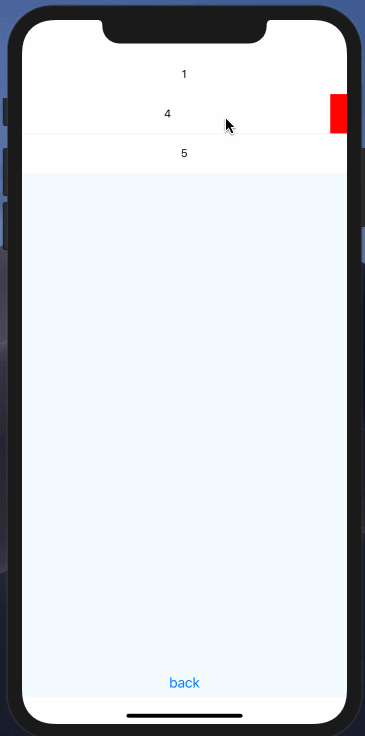

# react-native-sideslip
可以让任意view支持侧滑菜单，处理事件




##作者

QQ: 289459798
QQ群: 161263093

欢迎更多的喜欢开源的小伙伴加入

### 安装

依赖项目 
[react-native-interactable](https://github.com/wix/react-native-interactable)

```
> npm install react-native-sideslip --save
```

### android


### 使用方式

```
import Sideslip from 'react-native-sideslip'

<Sideslip.View ref={(r) => this.sideslipView = r} style={styles.container}>
    <FlatList
        style={{flex: 1}}
        data={this.state.list}
        keyExtractor={(item, key) => key + ""}
        renderItem={({item, index}) =>

            <Sideslip.Row
                key={index}
                sideslipView={() => this.sideslipView}
                menus={[{
                    title: "关注", color: '#f5f5f5', textStyle: {color: '#333'}, onPress: (view) => {
                    }
                }, {
                    title: "删除", color: 'red', type: 'delete', onPress: (view) => {
                        let list = this.state.list.slice();
                        list.splice(index, 1);
                        this.setState({list: list});
                    }
                }]}
            >
                <View style={{
                    flex: 1,
                    backgroundColor: '#FFF',
                    height: 50,
                    alignItems: 'center',
                    justifyContent: 'center'
                }}>
                    <Text>{item}</Text>
                </View>
            </Sideslip.Row>
        }
        ItemSeparatorComponent={() => <View
            style={{height: StyleSheet.hairlineWidth, backgroundColor: '#e2e2e2'}}/>}

    >

    </FlatList>
</Sideslip.View>

```

### Sideslip.View

必须在最外层用这个view包起来，不然无法处理一些点击事件


### Sideslip.Row

需侧滑菜单功能的需要用该view包起来

#### 属性

|属性名|类型|备注|
| ------ | ------ | ------ |
|sideslipView|func|必须属性，需要返回Sideslip.View 的ref|
|menus|array|title(string，菜单名称), color(string，背景颜色), textStyle(文本样式), type(string, 目前只有delete，删除功能必须传delete), onPress
(func)|
